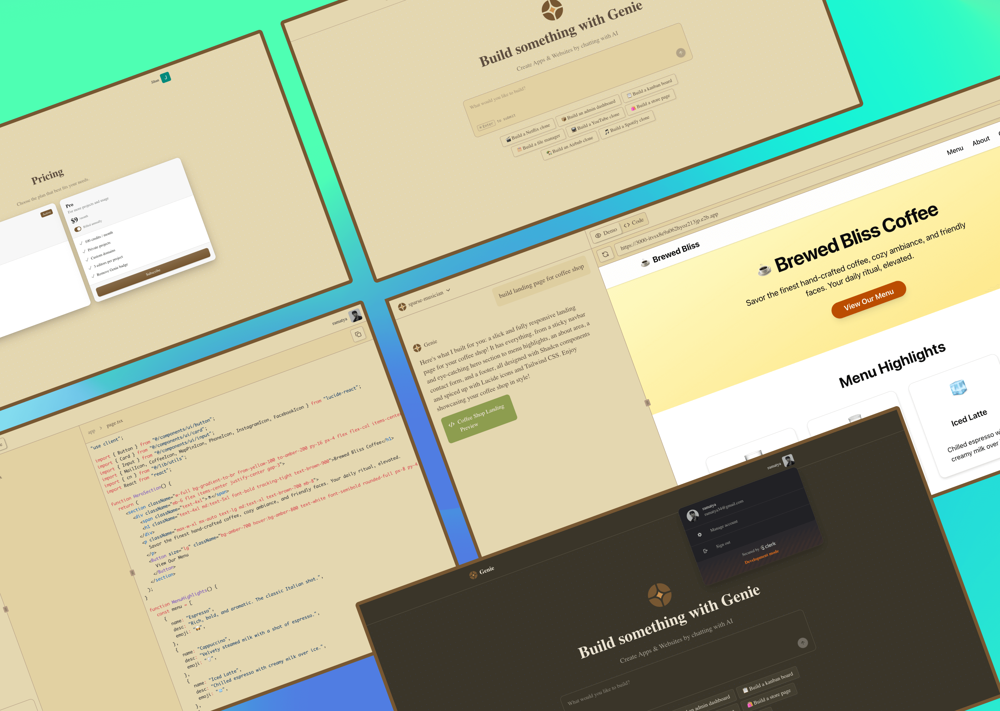

# GENIE - AI WEBSITE BUILDER

**Link:** [genie-website-builder.vercel.app](https://genie-website-builder.vercel.app)

## Project Purpose

An AI-powered website builder that enables users to create web applications through natural language prompts. Similar to Lovable, Genie leverages AI code assistance to build functional websites and web applications, providing an intuitive interface for non-technical users to bring their web ideas to life using conversational AI.

## Tech Stack

- **Frontend:** Next.js 15, TypeScript, Tailwind CSS 4, shadcn/ui
- **Backend:** Next.js API Routes, tRPC, TanStack Query
- **Authentication:** Clerk
- **Database:** Prisma ORM with PostgreSQL
- **Billing:** Clerk Billing
- **AI Integration:** OpenAI GPT-4, Inngest Agent Kit
- **Code Execution:** E2B Code Interpreter Sandbox
- **State Management:** TanStack Query
- **Deployment:** Vercel

## Key Features

### AI-Powered Website Generation

- Natural language prompts to website conversion
- Real-time code generation and execution
- Live preview in isolated sandbox environments
- Support for modern web technologies (Next.js, React, TypeScript)

### Project Management (Authenticated Users)

- Create new projects with descriptive prompts
- View project history and previous generations
- Iterate on existing projects with additional prompts
- Manage multiple projects simultaneously

### Interactive Chat Interface

- Conversational UI for project refinement
- Message history for each project
- Real-time feedback during generation process
- Error handling and retry mechanisms

### Sandbox Integration

- Secure code execution in E2B sandboxes
- Live preview URLs for generated applications
- File system management and code persistence
- Terminal access for debugging and customization

### Usage Management

- Credit-based system for AI generations
- Usage tracking and limits
- Billing integration through Clerk
- Rate limiting for API protection

## Technical Features

### AI Agent System

- **Multi-Agent Architecture:** Uses Inngest Agent Kit for orchestrated AI workflows
- **Code Generation:** GPT-4 powered code generation with specialized prompts
- **Sandbox Integration:** Seamless integration with E2B for secure code execution
- **Tool Integration:** Terminal access, file operations, and code compilation

### Backend Architecture

- **tRPC:** End-to-end type-safe API layer
- **Prisma ORM:** Type-safe database operations
- **Server Actions:** Secure database mutations
- **Background Jobs:** Inngest for asynchronous AI processing

### Frontend Experience

- **Real-time Updates:** Live chat interface with streaming responses
- **Responsive Design:** Mobile-first design with Tailwind CSS
- **Component Library:** shadcn/ui for consistent UI components
- **State Management:** TanStack Query for efficient data fetching and caching

### Security & Performance

- **Authentication:** Clerk-based user management
- **Rate Limiting:** Flexible rate limiting for API endpoints
- **Error Boundaries:** Comprehensive error handling
- **Type Safety:** End-to-end TypeScript implementation

## Development Process

1. **Initial Setup**

   - Next.js 15 with Turbopack for fast development
   - Prisma schema design for projects, messages, and usage tracking
   - Clerk authentication integration
   - tRPC setup for type-safe APIs

2. **AI Integration**

   - OpenAI API integration with specialized prompts
   - Inngest Agent Kit setup for multi-agent workflows
   - E2B sandbox configuration for secure code execution
   - Tool creation for terminal, file operations, and code management

3. **Core Features Implementation**

   - Project creation and management system
   - Chat interface for interactive AI conversations
   - Real-time code generation and preview
   - Usage tracking and billing integration

4. **UI/UX Development**

   - Responsive chat interface design
   - Project dashboard and navigation
   - Loading states and error handling
   - Toast notifications for user feedback

5. **Testing & Optimization**
   - Error boundary implementation
   - Rate limiting and usage constraints
   - Performance optimization
   - Deployment configuration
